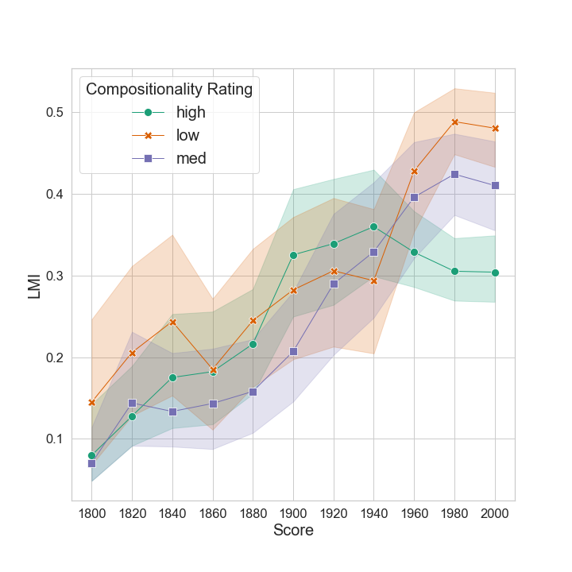

# Measuring the Compositionality of Noun-Noun Compounds over Time

Compositionality describes the phenomenon that the meaning of complex expressions can be directly derived by the meaning of its parts. For example, the compound `speed limit` can be directly understood when knowing what `speed` and `limit` mean separately. A `speed limit` is then simply a limitation of speed. Other compounds are less transparent, like `ivory tower`, where there might well be a literal meaning of a tower made out of ivory, but the common meaning is idiomatic and describes an unwillingness of dealing with practical issues, often connected to an academic context. In any case, this meaning of `ivory tower` can not be directly derived by the meanings of `ivory` and `tower`.  
One might assume that such a property could also change over time, as compounds might get less transparent and therefore less compositional over time. The code provided in this repository enables to run experiments that aim to investigate this question.

## Description

The general code base is divided across several ipython files that can be used independently. Several shell scripts allow for an easier and automated processing.

### Dimensionality reduction

The scripts [`../src/feature_extracter_dense_embeddings.sh`](../src/feature_extracter_dense_embeddings.sh) and [`dimreduce.sh`](dimreduce.sh) can be used to easily extract features for different setups. The output of the former can be given into the latter. In order to run the experiments for the different setups, the files needs to be edited directly. There are different options:

- `CUTOFF`: Control the frequency-cutoff for compounds per time span. In order to give a list to iterate over, provide all cutoff values space-separated, e.g. `CUTOFF="20 50 100"`
- `TIMESPAN`: Control for the different possible time spans to compare. Time spans can be provided identically to CUTOFF, so for example `TIMESPAN="1 10 20 50"`. Giving a time span of `0` means to not use any temporal information at all.

[`dimreduce.sh`](dimreduce.sh) calls the python script [`dimreduce.py`](dimreduce.py), which itself takes certain arguments that can be edited in [`dimreduce.sh`](dimreduce.sh) directly:

- `--contextual`: Should the model be aware of compounds?
- `--embeddings`: Either `sparse` or `dense`
- `--seed`: Provide a random seed, defaults to `1991`
- `--storedf`: Should the embeddings be saved?
- `--dims`: Number of to-be-reduced dimensions, defaults to `300`
- `--save_format`: Either `csv` or `pkl`

`--temporal` and `--cutoff` are controlled by [`dimreduce.sh`](dimreduce.sh) and do not need to be changed.

Similarly, [`../src/feature_extracter_dense_embeddings.sh`](../src/feature_extracter_dense_embeddings.sh) make use of [`../src/feature_extracter_dense_embeddings.py`](../src/feature_extracter_dense_embeddings.py).

### Visualization

With the extracted embeddings, we can also create visualizations. Some examples thereof can be found in [`Notebooks/paper_submission.ipynb`](Notebooks/paper_submission.ipynb), which makes use of the features extracted by [`dimreduce.sh`](dimreduce.sh).



## Collaborators

- [Prajit Dhar](https://www.rug.nl/staff/p.dhar/research)

- [Janis Pagel](https://janispagel.de)

- [Lonneke van der Plas](https://sites.google.com/site/lonnekenlp)

## How to cite

```BibTeX
@inproceedings{dhar-etal-2019-measuring,
    title = "Measuring the Compositionality of Noun-Noun Compounds over Time",
    author = "Dhar, Prajit  and
      Pagel, Janis  and
      van der Plas, Lonneke",
    booktitle = "Proceedings of the 1st International Workshop on Computational Approaches to Historical Language Change",
    month = aug,
    year = "2019",
    address = "Florence, Italy",
    publisher = "Association for Computational Linguistics",
    url = "https://www.aclweb.org/anthology/W19-4729",
    pages = "234--239",
}
```

The paper is available from [here](https://www.aclweb.org/anthology/W19-4729).
There are also preprints on [arXiv](https://arxiv.org/abs/1906.02563).
